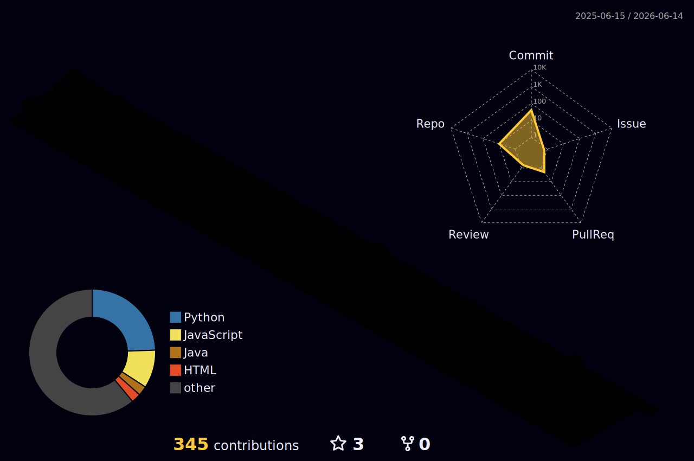

<h1 align="center">Hi 👋, I'm Perireddy Vaka</h1>

<h3 align="center">
Research Engineer | Backend Systems Engineer | FastAPI Developer
</h3>

  

---

# 👨‍💻 About Me

- 🔭 Working on System Designing & Smart City Research
- 🌱 Learning LLMs, RAG, Agentic AI
- 🚀 Building scalable FastAPI backend systems
- 📚 Interested in:
  - Distributed Systems
  - High Performance APIs
  - PostgreSQL Optimization
  - AI Infrastructure
  - OM2M Systems

---

# 🚀 Tech Stack

---

# 📊 GitHub Stats

---

# 🔥 GitHub Streak

---

# 🏆 GitHub Trophies

---

# 📚 Research Interests

- AI Systems
- Smart City Platforms
- FastAPI Architectures
- PostgreSQL Optimization
- OM2M Middleware
- Distributed Backend Systems

---

# 🌐 Connect With Me

---

---

# 🚀 Contribution Visualizations

---

# 🐍 Contribution Snake

